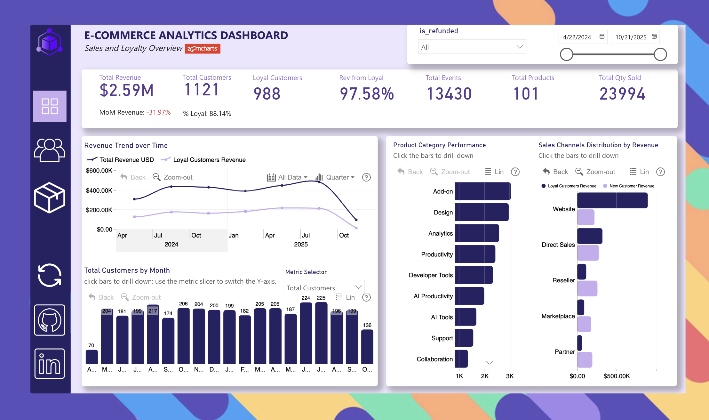
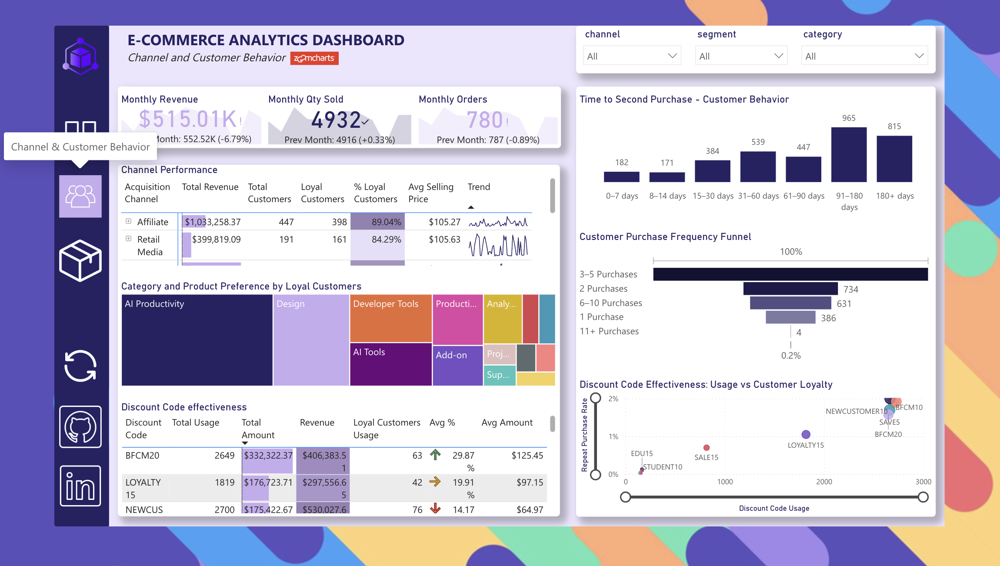
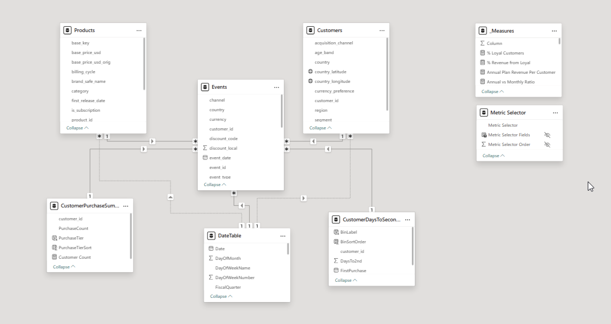

# 📊 E-commerce Analytics Dashboard


> Interactive Power BI dashboard analysing 18 months of e-commerce sales data (14K+ transactions, 4K customers, 101 products) to identify loyal customers and optimise revenue strategy.

---

## 🎯 Project Overview

**The Challenge**: A global software retailer needed to identify loyal customers (repeat buyers) and understand which channels and campaigns drive repeat purchases.

**The Solution**: A 3-page Power BI dashboard delivering actionable insights on customer loyalty, channel performance, and revenue optimisation.

**Key Dataset Stats**:
- 📅 18 months (Apr 2024 - Oct 2025)
- 💰 14,399 invoices analysed
- 👥 4,000 unique customers
- 📦 101 products across 4 categories
- 🌍 Multiple countries & currencies

---

## 📑 Dashboard Pages

### **Page 1: Sales & Loyalty Overview**
Executive summary with KPIs, revenue trends, and channel performance split by loyal vs. new customers.

### **Page 2: Customer Behaviour Analysis**  
Deep dive into repeat purchase patterns, discount effectiveness, and time-to-second-purchase metrics.

### **Page 3: Revenue Optimisation**
Pricing analysis (ASP by country), annual vs. monthly plan comparison, refund patterns, and product attach rates.

---

## 💡 Key Insights

**Customer Loyalty**:
- Loyal customers (2+ purchases) generate 97.65% of revenue
- Loyal customers have X% higher AOV than new customers

**Channel Performance**:
- [Website] drives the highest revenue
- [Email] has the highest loyal customers

**Revenue Optimization**:
- Annual plans generate 96% more revenue per customer than monthly
- Top discount code "BFCM10" correlates with higher repeat purchases


---

## 🛠️ Technical Highlights

**Data Modeling**:
- Star schema with Events (fact), Customers, Products, DateTable (dimensions)
- Relationships optimised for query performance

**Advanced DAX Measures**:
```dax
Loyal Customers = 
VAR CustomerPurchaseCounts = 
    ADDCOLUMNS(VALUES(Events[customer_id]),
        "PurchaseCount", 
        CALCULATE(COUNTROWS(Events), Events[event_type] = "Invoice"))
RETURN
    COUNTROWS(FILTER(CustomerPurchaseCounts, [PurchaseCount] >= 2))

Avg Days to 2nd Purchase = 
VAR CustomerFirstSecond = 
    ADDCOLUMNS(VALUES(Events[customer_id]),
        "FirstPurchase", CALCULATE(MIN(Events[event_date]), Events[event_type] = "Invoice"),
        "SecondPurchase",
            VAR FirstDate = CALCULATE(MIN(Events[event_date]), Events[event_type] = "Invoice")
            RETURN CALCULATE(MIN(Events[event_date]), 
                Events[event_type] = "Invoice", Events[event_date] > FirstDate))
VAR DaysBetween = FILTER(CustomerFirstSecond, NOT(ISBLANK([SecondPurchase])))
RETURN AVERAGEX(DaysBetween, DATEDIFF([FirstPurchase], [SecondPurchase], DAY))
```

**Key Features**:
- Time intelligence for MoM growth tracking
- Customer segmentation (loyal vs. new)
- Conditional formatting and dynamic KPIs
- Cross-page filtering and drill-through
- Icon-based navigation

---

## 📸 Screenshots

### Dashboard Overview




### Data Model


---

## 🚀 How to Use

1. **Download**: Clone this repo or download the `.pbix` file
2. **Open**: Launch with Power BI Desktop (latest version)
3. **Explore**: Use slicers to filter by date, channel, product category
4. **Navigate**: Click page icons to switch between views

```bash
git clone https://github.com/pythonist4444/E-Commerce_Report
```

---

## 📂 Repository Structure

```
├── Ecommerce_Report.pbix    # Main Power BI file
├── Ecommerce_Report.pdf    # Power BI PDF file
├── screenshots/                           # Dashboard images
├── dax_measures/                          # All DAX code                             
└── README.md                              # This file
```

---

## 🎓 Skills Demonstrated

- **Power BI**: Data modeling, DAX, interactive dashboards, visual design
- **Analytics**: Customer segmentation, cohort analysis, trend analysis, KPI development
- **Business Intelligence**: Translating requirements to insights, storytelling with data

---

## 📞 Connect

**[Olamide Fakorede]**  
💼 [LinkedIn](https://www.linkedin.com/in/abdulafeezfakorede/)  
🐙 [GitHub](https://github.com/pythonist4444)

---

## 📄 License

MIT License - see [LICENSE](LICENSE) file

---

<div align="center">

**⭐ Star this repo if you found it helpful!**

</div>
